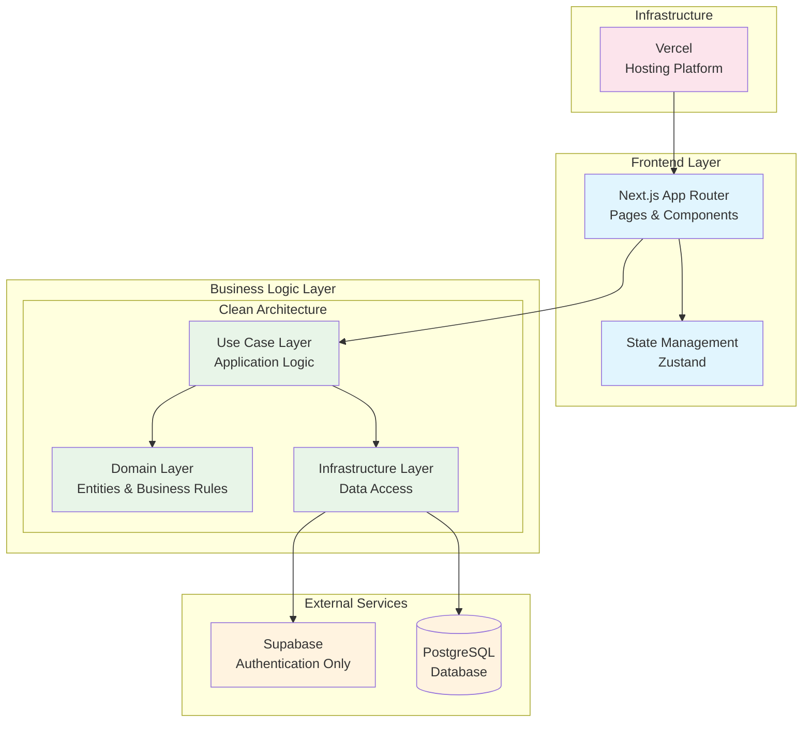

## 用語定義

- 支払い
- 請求
- グループ

## 要件定義

- サインアップ
- ログイン
- 支払い作成
    - グループに所属しているユーザーのみが作成できる
    - 入力値
        - タイトル
        - 支払者
        - 金額
        - メモ
        - 個別の請求金額
- 支払い一覧（グループ）
    - グループに所属しているユーザーのみが閲覧できる
    - グループで作成された支払いを古い順にソートする
- 支払い一覧（個人）
    - 自分に請求があって未払いの支払いを古い順にソートする
- 支払い詳細
    - グループに所属しているユーザーのみが閲覧できる
- 支払い編集
    - グループに所属しているユーザーのみが編集できる
- グループ作成
    - 作成後、自分だけがグループに所属している
    - 入力値
        - グループ名
- グループ一覧
    - 自分が所属しているグループの一覧
- グループ編集
    - 自分が所属しているグループのみが編集できる
    - グループ名を編集できる
    - ユーザーを削除できる
- グループ招待
    - 招待リンクを発行できる
- グループ加入
    - 招待リンクからグループに加入することができる

## アプリケーション構成

| 技術                  | 用途       |
|---------------------|----------|
| supabase            | 認証       |
| postgreSQL          | DB       |
| vercel              | インフラ     |
| Nextjs（+ AppRouter） | アプリケーション |

## 認証

- supabase の Authentication
    - email
    - google oauth

## テーブル設計

- Users：ユーザー

    | column | | type |  |
    | --- | --- | --- | --- |
    | id | PK | int |  |
    | auth_id | unique | int | supabaseのauthenticationのIDを保持する |
    | email | unique | string |  |
    | nickname |  | string |  |
    | created_at |  | timestamptz |  |
    | updated_at |  | timestamptz |  |
- Payments：1回の支払い

    | column | | type |  |
    | --- | --- | --- | --- |
    | id | PK | int |  |
    | title |  | string |  |
    | amount |  | int | 支払いの総額 |
    | note |  | text |  |
    | status |  | string |  |
    | creator_id | FK | int | 支払いを行ったユーザー。
    Userとの外部キー。 |
    | paid_at |  | timestamptz |  |
    | created_at |  | timestamptz |  |
    | updated_at |  | timestamptz |  |
- DebtRelations：分割された請求情報

    | column | | type |  |
    | --- | --- | --- | --- |
    | id | PK | int |  |
    | split_amount |  | int |  |
    | status |  | string |  |
    | payment_id |  | int |  |
    | repayer_id | FK | int | ⚠️ payee_id から renameする
    返済する人。Userとの外部キー。 |
    | paid_at |  | timestamptz |  |
    | created_at |  | timestamptz |  |
    | updated_at |  | timestamptz |  |
- Group：ワークスペース的な概念

    | column | | type |  |
    | --- | --- | --- | --- |
    | id | PK | int |  |
    | uid | unique |  |  |
    | name |  |  |  |
- GroupUser：グループに所属しているユーザー

    | column | | type |  |
    | --- | --- | --- | --- |
    | id | PK | int |  |
    | group_id | FK |  |  |
    | user_id | FK |  |  |
    | nickname |  |  |  |

## API設計

### 認証
- POST /v1/auth/signup
  - Request: { email: string, password: string, nickname: string }
  - Response: { user: User }
- POST /v1/auth/login
  - Request: { email: string, password: string }
  - Response: { user: User }
- GET /v1/auth/session
  - Response: { user: User }

### 支払い
- POST /v1/payments
  - Request: { title: string, amount: number, note?: string, payer_id: number, group_id: number, debt_details: { repayer_id: number, split_amount: number }[] }
  - Response: { payment: Payment }
- GET /v1/payments/group/:group_id
  - Response: { payments: Payment[] }
  - グループで作成された支払いを古い順にソート
- GET /v1/payments/unpaid
  - Response: { payments: Payment[] }
  - 自分に請求があって未払いの支払いを古い順にソート
- GET /v1/payments/:id
  - Response: { payment: Payment, debt_details: DebtDetail[] }
- PUT /v1/payments/:id
  - Request: { title?: string, amount?: number, note?: string, debt_details?: { id?: number, repayer_id: number, split_amount: number }[] }
  - Response: { payment: Payment }

### グループ
- POST /v1/groups
  - Request: { name: string }
  - Response: { group: Group }
- GET /v1/groups
  - Response: { groups: Group[] }
- PUT /v1/groups/:id
  - Request: { name?: string }
  - Response: { group: Group }
- DELETE /v1/groups/:id/users/:user_id
  - Response: { success: boolean }

### グループ招待・加入
- POST /v1/groups/:id/invite
  - Response: { invite_url: string }
- POST /v1/groups/join
  - Request: { invite_token: string }
  - Response: { group: Group }